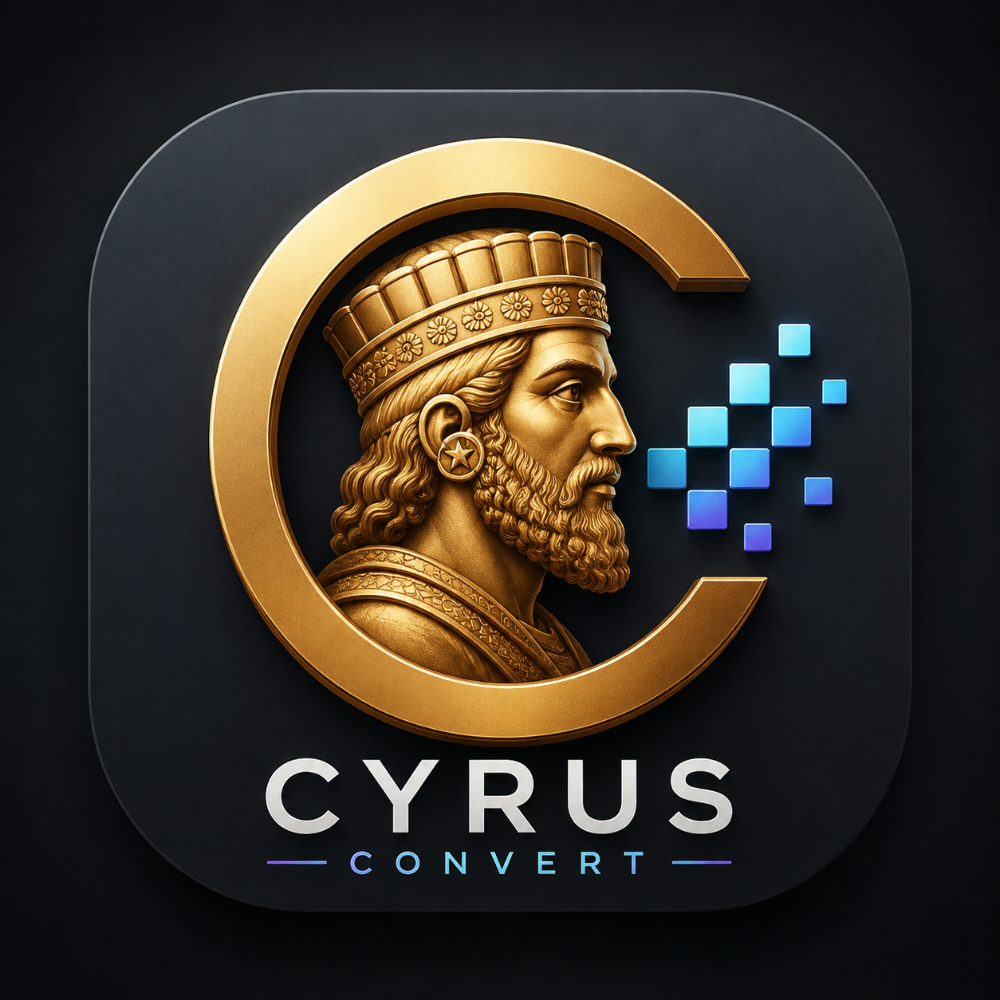
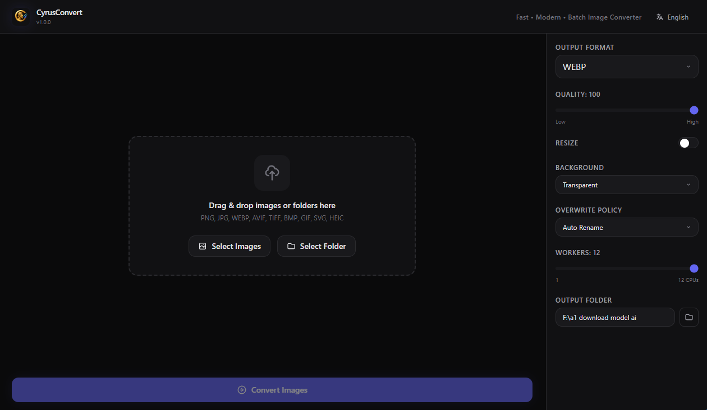
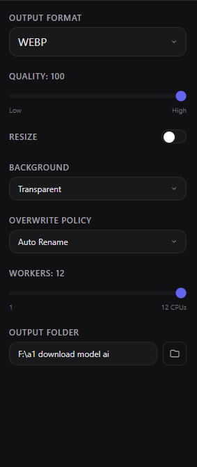
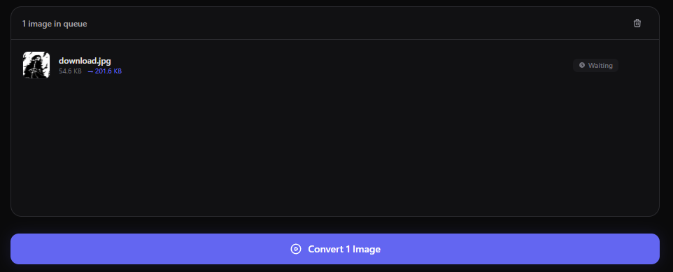
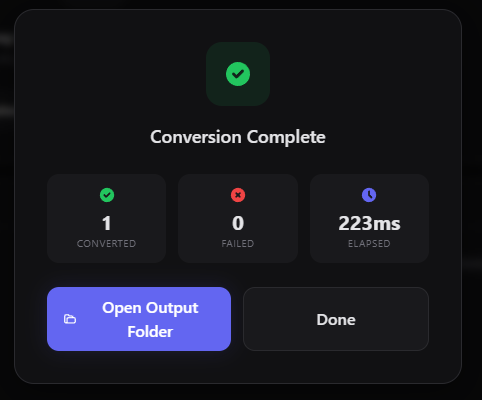

# CyrusConvert


<div align="center">



### Fast • Modern • Batch Image Converter

[](https://github.com/Nestr0/CyrusConvert/releases)
[](LICENSE)
[](#download)
[](https://www.electronjs.org/)
[](https://react.dev/)
[](https://www.typescriptlang.org/)

A high-performance desktop application for Windows that converts images between formats with batch processing, resize capabilities, and a modern dark-themed UI.

[Download](#-download) • [Features](#-features) • [Documentation](#-getting-started) • [Contributing](#-contributing)

</div>

---

## ✨ Features

| Feature | Description |
|---------|-------------|
| 🔄 **Batch Conversion** | Process hundreds of images simultaneously with configurable worker threads |
| 🖼️ **Multi-Format Support** | Convert between PNG, JPEG, WEBP, AVIF, TIFF, BMP, GIF, SVG, HEIC |
| 📐 **Smart Resize** | Resize with multiple fit modes (contain, cover, fill, inside, outside) |
| 🎨 **Background Control** | Set transparent, white, black, or custom hex background for flattened outputs |
| ✏️ **Flexible Renaming** | Keep original names, add prefix/suffix, or use custom patterns |
| ⚡ **Drag & Drop** | Drop individual files or entire folders onto the app |
| 📁 **Recursive Scanning** | Automatically discovers all images in nested directories |
| 📊 **Real-Time Progress** | Live progress bar with ETA and per-job status tracking |
| 💾 **Persistent Settings** | All preferences saved automatically |
| 🔧 **Worker Thread Pool** | CPU-optimized parallel processing using Node.js worker_threads |
| 🌙 **Modern Dark UI** | Sleek Tailwind CSS interface with smooth animations |
| 🌍 **12 Languages** | Full internationalization support |

## 📸 Screenshots

<div align="center">

| Main Interface | Settings Panel |
|:-:|:-:|
|  |  |

| Conversion Progress | Completion Screen |
|:-:|:-:|
|  |  |

</div>


## 📥 Download

### Windows Installer

Download the latest installer from the [Releases](https://github.com/Nestr0/CyrusConvert/releases) page:

- **[CyrusConvert-1.0.0-Setup.exe](https://github.com/Nestr0/CyrusConvert/releases/download/v1.0.0/CyrusConvert-1.0.0-Setup.exe)** - Windows 10/11 (64-bit)

### System Requirements

- Windows 10 or later (64-bit)
- 4 GB RAM minimum (8 GB recommended for large batches)
- 200 MB free disk space

## 🎯 Supported Formats

### Input Formats
PNG, JPG/JPEG, WEBP, AVIF, TIFF/TIF, BMP, GIF, SVG, HEIC/HEIF

### Output Formats
PNG, JPEG, WEBP, AVIF, TIFF

## 🛠️ Tech Stack

| Layer | Technology | Version |
|-------|-----------|---------|
| Framework | Electron | 36.x |
| Build Tool | Vite | 6.x |
| Frontend | React | 19.x |
| Language | TypeScript | 5.8.x |
| Styling | Tailwind CSS | 3.4.x |
| State Management | Zustand | 5.x |
| Image Processing | Sharp | 0.34.x |
| i18n | i18next | 26.x |
| Persistence | electron-store | 8.x |
| Icons | react-icons | 5.x |
| Packaging | electron-builder | 26.x |

## 🌍 Supported Languages

CyrusConvert supports 12 languages out of the box:

| Language | Code | Language | Code |
|----------|------|----------|------|
| 🇺🇸 English | `en` | 🇷🇺 Russian | `ru` |
| 🇮🇷 Persian (فارسی) | `fa` | 🇸🇪 Swedish | `sv` |
| 🇩🇪 German | `de` | 🇹🇷 Turkish | `tr` |
| 🇪🇸 Spanish | `es` | 🇨🇳 Chinese | `zh` |
| 🇫🇷 French | `fr` | 🇯🇵 Japanese | `ja` |
| 🇵🇹 Portuguese | `pt` | 🇰🇷 Korean | `ko` |

The app automatically detects your system language. You can also change it manually in the settings.

## 🚀 Getting Started

### Prerequisites

- **Node.js** ≥ 18.x
- **npm** ≥ 9.x
- **Windows** 10/11 (target platform)

### Installation

```bash
# Clone the repository
git clone https://github.com/Nestr0/CyrusConvert.git
cd CyrusConvert

# Install dependencies
npm install
```

### Development

```bash
# Start development server with hot-reload
npm run dev
```

This starts Vite's dev server and launches Electron. Changes to React components reload instantly; changes to electron main/preload trigger an app restart.

### Type Checking

```bash
npm run typecheck
```

Runs TypeScript compiler in noEmit mode for both renderer and electron codebases.

### Production Build

```bash
npm run build
```

Compiles TypeScript, builds the Vite renderer bundle, and compiles the Electron main process.

### Package Installer

```bash
npm run dist
```

Generates a Windows NSIS installer at `release/CyrusConvert-{version}-Setup.exe`.

## 🏗️ Architecture

### Project Structure

```
CyrusConvert/
├── electron/                    # Electron main process
│   ├── main.ts                  # Entry point, window creation, IPC handlers
│   ├── preload.ts               # Context bridge (secure IPC API)
│   ├── shared-types.ts          # Shared TypeScript types
│   ├── services/
│   │   └── conversion.ts        # Batch conversion orchestrator
│   └── workers/
│       ├── image-worker.ts      # Sharp processing worker thread
│       └── pool.ts              # Worker pool manager
├── src/                         # React renderer process
│   ├── main.tsx                 # React entry point
│   ├── App.tsx                  # Main app layout
│   ├── index.css                # Tailwind + custom styles
│   ├── i18n.ts                  # i18next configuration
│   ├── types/index.ts           # Shared types for renderer
│   ├── store/useAppStore.ts     # Zustand state management
│   ├── hooks/useIpcListeners.ts # IPC event listeners
│   ├── utils/format.ts          # Formatting utilities
│   ├── locales/                 # Translation files (12 languages)
│   └── components/
│       ├── Header.tsx           # App header with language selector
│       ├── DropZone.tsx         # Drag & drop area
│       ├── ImageQueue.tsx       # Image list with thumbnails
│       ├── SettingsPanel.tsx    # Conversion settings sidebar
│       ├── ProgressBar.tsx      # Real-time progress display
│       └── CompletionScreen.tsx # Results summary modal
├── resources/                   # App icons and assets
├── release/                     # Packaged installer output
├── docs/                        # Documentation and screenshots
├── electron-builder.yml         # Packaging configuration
├── vite.config.ts               # Vite configuration
├── tailwind.config.js           # Tailwind CSS configuration
├── tsconfig.json                # TypeScript config (renderer)
├── tsconfig.electron.json       # TypeScript config (main process)
└── package.json
```

### Worker Thread Pool

Image processing runs in isolated Node.js worker threads to prevent blocking the Electron main process:

```
┌─────────────────────────────────────────────────────────────┐
│                      Renderer Process                        │
│  ┌─────────────┐  ┌─────────────┐  ┌─────────────────────┐  │
│  │  DropZone   │  │ ImageQueue  │  │   SettingsPanel     │  │
│  └─────────────┘  └─────────────┘  └─────────────────────┘  │
│                           │                                  │
│                    ┌──────▼──────┐                           │
│                    │ Zustand     │                           │
│                    │ Store       │                           │
│                    └──────┬──────┘                           │
└───────────────────────────┼─────────────────────────────────┘
                            │ IPC (context-isolated)
┌───────────────────────────▼─────────────────────────────────┐
│                       Main Process                           │
│  ┌────────────────────────────────────────────────────────┐ │
│  │              ConversionService                          │ │
│  └────────────────────────┬───────────────────────────────┘ │
│                           │                                  │
│                    ┌──────▼──────┐                           │
│                    │ WorkerPool  │                           │
│                    └──────┬──────┘                           │
│              ┌────────────┼────────────┐                     │
│         ┌────▼────┐  ┌───▼────┐  ┌───▼────┐                │
│         │Worker 1 │  │Worker 2│  │Worker N│                │
│         │ (Sharp) │  │(Sharp) │  │(Sharp) │                │
│         └─────────┘  └────────┘  └────────┘                │
└─────────────────────────────────────────────────────────────┘
```

- Pool size defaults to `CPU cores - 1` (configurable in UI)
- Each worker receives jobs via `postMessage`
- Failed workers are automatically respawned

### IPC Bridge

Communication uses Electron's context-isolated preload script. All API methods are exposed via `window.electronAPI`:

| Method | Description |
|--------|-------------|
| `selectImages()` | Open file dialog for image selection |
| `selectFolder()` | Select folder and recursively find images |
| `selectOutputFolder()` | Choose output destination |
| `startConversion(files, settings, output)` | Begin batch conversion |
| `cancelConversion()` | Stop current conversion |
| `getThumbnail(path)` | Generate preview thumbnail |
| `estimateOutputSize(path, settings)` | Estimate output file size |
| `getSettings()` / `saveSettings()` | Persistent settings |
| `onProgress(cb)` | Listen to progress events |
| `onJobUpdate(cb)` | Listen to individual job status |
| `onComplete(cb)` | Listen to completion event |

## ⚙️ Configuration

### Default Settings

| Setting | Default Value |
|---------|---------------|
| Output Format | WEBP |
| Quality | 80 |
| Resize | Disabled |
| Background | Transparent |
| Overwrite Policy | Auto Rename |
| Workers | Auto (CPU - 1) |

### Custom Rename Patterns

Available placeholders:

| Placeholder | Description | Example |
|-------------|-------------|---------|
| `{name}` | Original filename without extension | `photo` |
| `{index}` | Zero-padded sequential number | `001`, `002` |
| `{ext}` | Output file extension | `webp` |

**Examples:**
- `product-{index}` → `product-001.webp`, `product-002.webp`
- `{name}_converted` → `photo_converted.webp`
- `img_{index}_{name}` → `img_001_photo.webp`

### Overwrite Policies

| Policy | Behavior |
|--------|----------|
| Auto Rename | Append `(1)`, `(2)`, etc. to avoid conflicts |
| Replace | Overwrite existing files |
| Skip | Skip files that already exist |

## 🤝 Contributing

Contributions are welcome! Please feel free to submit a Pull Request.

### Development Setup

1. Fork the repository
2. Create your feature branch (`git checkout -b feature/AmazingFeature`)
3. Commit your changes (`git commit -m 'Add some AmazingFeature'`)
4. Push to the branch (`git push origin feature/AmazingFeature`)
5. Open a Pull Request

### Adding a New Language

1. Copy `src/locales/en.json` to `src/locales/{code}.json`
2. Translate all keys
3. Add the language to `src/i18n.ts`
4. Submit a PR

### Code Style

- Use TypeScript strict mode
- Follow existing naming conventions
- Run `npm run typecheck` before committing

## 📋 Roadmap

- [ ] Linux support (AppImage, deb)
- [ ] macOS support (DMG)
- [ ] Image optimization options
- [ ] Preset profiles
- [ ] Command-line interface
- [ ] Plugin system for custom filters
- [ ] Cloud storage integration

## 🐛 Known Issues

- HEIC/HEIF support requires additional native dependencies on some systems
- Very large batches (>10,000 images) may require increased memory allocation

## 📄 License

This project is licensed under the MIT License - see the [LICENSE](LICENSE) file for details.

## 🙏 Acknowledgments

- [Sharp](https://sharp.pixelplumbing.com/) - High performance image processing
- [Electron](https://www.electronjs.org/) - Cross-platform desktop apps
- [React](https://react.dev/) - UI library
- [Tailwind CSS](https://tailwindcss.com/) - Utility-first CSS framework
- [Zustand](https://zustand-demo.pmnd.rs/) - Simple state management

## 📞 Support

If you encounter any issues or have questions:

1. Check the [Issues](https://github.com/Nestr0/CyrusConvert/issues) page
2. Create a new issue with detailed description
3. Include system info and steps to reproduce

---

<div align="center">

**Made with ❤️ for the community**

[Report Bug](https://github.com/Nestr0/CyrusConvert/issues) • [Request Feature](https://github.com/Nestr0/CyrusConvert/issues) • [Discussions](https://github.com/Nestr0/CyrusConvert/discussions)

</div>
